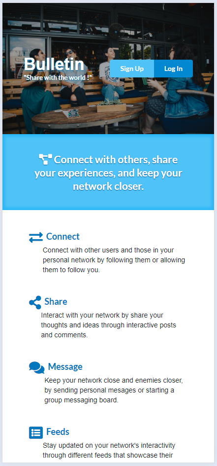
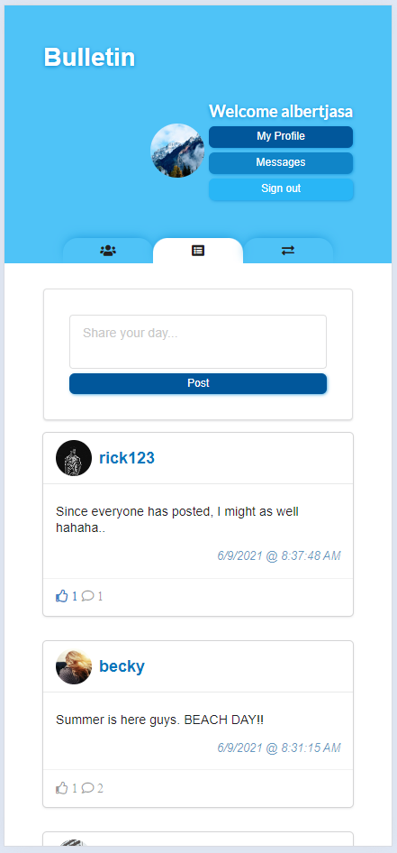
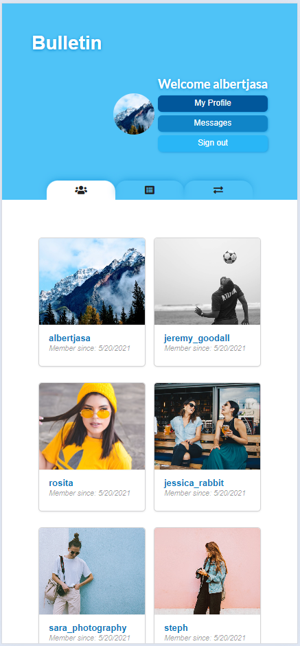
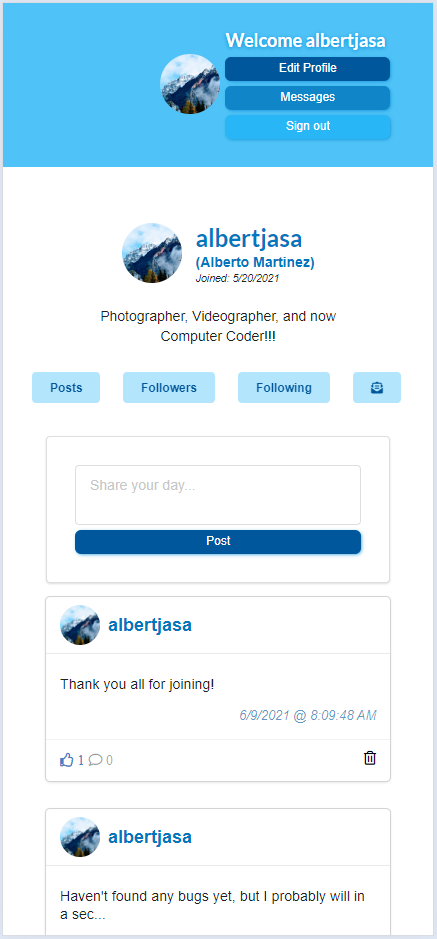
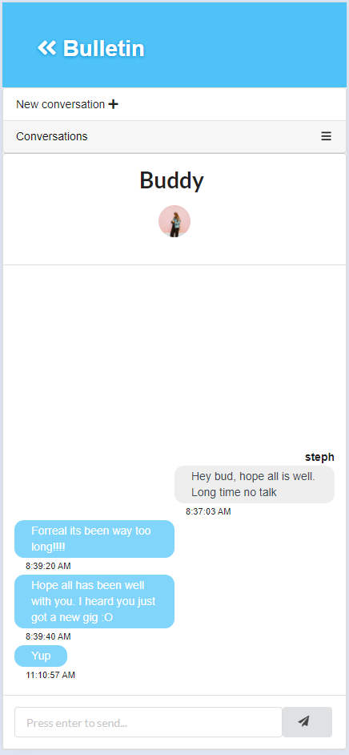

Social-Media-Site

 
 
<!--   -->
<!--    -->
  

## Capstone Project (Bulletin - "Share with the world!")
* Bulletin is a social media site dedicated to connecting users around the world. It allows users to connect with each other through
 posts, comments, messages, likes, and follows. It's a site that can serve as a template for a LAN (Local Area Network) setting like say a
 business or the TLM classroom.

* The site runs using a LocalStorage database it is not yet cross-platform compatible
 and only bound to a local computer, meaning that only users accessing the offline site on the same computer can interact with each other.
 This being the case these alpha versions are mainly to display the groundwork and functionalities for the site when it does have a server
 backing and be broadcast to others.

##### Important Information
* In order to display the feeling of the site's (for the lack of a better word) "activeness", preset data is set to be injected into the user's
  browser LocalStorage upon load. This data is all found under the /db directory and corresponding files.
* To further display additional "activeness", example logins are provided underneath that can be logged into to view some of the data already set
  specific to the user (e.g. messages, feed, activity);

##################
##Example logins##
##################

const logins = [{
  username: albertjasa,
  password: PPrecios00.
},
{
  username: rosita,
  password: PPrecios00.
}]
